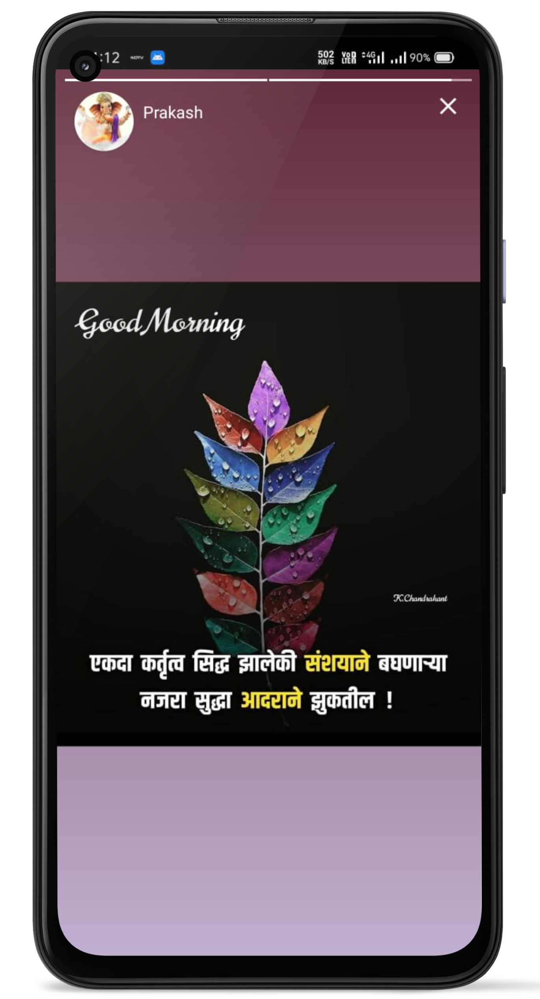

<h1 align="center">
    Y Talk
</h1>
<h2 align="center">
    A personal all-in-one instant chat messaging app. ✨
 </h2>
<h3 align="center">
  Built with ❤︎ by
  <a href="https://github.com/yashhalgaonkar">Yash Halgaonkar</a>
</h3>
<h3>Description</h3>

Y Talk is a personal chat messaging application where you can send messages to your friends and family. It also has feature of group chat, story/status update and much more.

<h3>Features </h3>
<ul>
<li>Private Messaging</li>
<li>Group Messaging</li>
<li>Reaacting to messages (Similar to Instagram)</li>
<li>Delete sent messages</li>
<li>Multimedia Sharing</li>
<li>Story and Status Update</li>
<li>Online Indicator</li>
<li>Typing Indicator</li>
<li>OTP Verification</li>
</ul>

<h3>Screenshots</h3>

  
  
   

  
  
   

  
  
  

 Do ⭐ the repo if you like it.   Contributions and pull requests are welcomed. 

